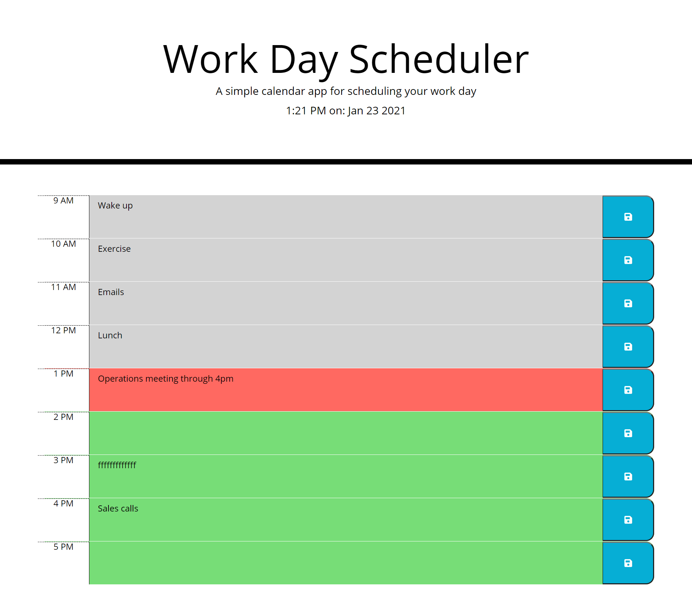

# day-planner

day planner application made with Day.js and JQuery

## Description

As a developer, we rely on a multitude of APIs in order to make our work simpler. APIs offer the functionality of an object retrievable database with the simple use of a CDN or plugin. Because APIs offer such a vast amount of immutable data for programmers to use in their applications, it is essential to learn how to read the documentation and implement them to increase efficiency. 

For this project, I will be building a light weight day planning application that utilizes Day.js in order to parse a user's location and current time. I chose 
Day.js due to its clear documentation, and the fact that it is a tried and true API that gives its users numerous methods that are a significant step up from moment.js's functionality. 

The application can be used as a powerful tool to help visualize one's schedules and improve organization. Time blocks will be color coded depending on whether or not it is in the past, present, or future, and all user inputs are saved with the click of a button. Additionally, the day planner will use local storage so that page refreshes do not erase user inputs.  

## Links

## Credits

